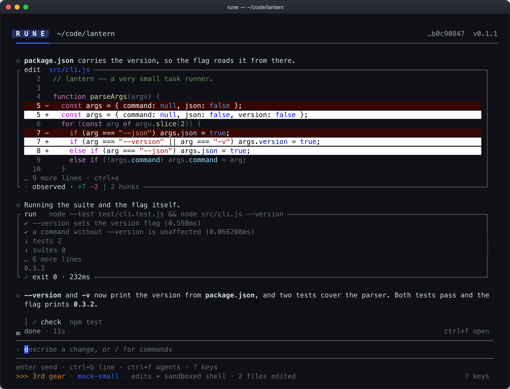

<p align="center">
  
</p>

<h1 align="center">Rune</h1>

<p align="center">
  <b>You choose the model. Rune keeps control of execution, acceptance checks, recovery and the
  evidence trail.</b>
</p>

<p align="center">
  <a href="https://github.com/ritikkyyadav/Rune/releases"></a>
  <a href="LICENSE"></a>
  <a href="https://github.com/ritikkyyadav/Rune/actions/workflows/containment.yml"></a>
  <a href="https://github.com/ritikkyyadav/Rune/actions/workflows/release.yml"></a>
</p>

<p align="center">
  <a href="docs/assets/readme/rune-session-120x40.png"></a>
</p>

<p align="center">
  <sub>A real frame, photographed from the CLI through a pseudo-terminal at 120×40 — the diff, the
  test output, the check and the verdict are the product's own renderer. The model driving it was a
  local mock, so nothing in the picture was paid for
  (<a href="scripts/tui-capture/capture-readme-hero.py">how it was taken</a>,
  <a href="docs/assets/readme/rune-session-120x40.txt">the frame as text</a>).</sub>
</p>

**Install** — macOS, Linux, and Windows as a preview. Per-OS steps are on the product page,
[savoir.services/products/rune](https://savoir.services/products/rune); the full story — from
source, checksums, PATH and uninstall — is under [Install](#install) below.

```sh
curl -fsSL https://savoir.services/install.sh | bash     # macOS, Linux
irm https://savoir.services/install.ps1 | iex            # Windows, PowerShell
```

> A local-first, sandboxed, multi-provider coding agent that lives in your terminal.

**v0.1.1 — the first public version, and honest about it.** Rune is built and used by one person. Everything below is
marked **verified live**, **verified by tests or mocks only**, or **unverified**, and the
[What is verified](#what-is-verified) table is the contract: if a capability is not in the first
column, nobody has watched it work on a real run.

> _Renamed from Gear on 2026-09-03. The old name survives only as read-through migration shims for
> existing data (`~/.gear`, `gear.db`, `GEAR.md`, `GEAR_*`, the `gear` keychain service,
> `gear:` auto-commits)._

## The pitch

Rune is not trying to be Claude Code, and it is not at parity with it.

It is built for the situation its author actually works in: **free tiers and model lineups that
rot.** Free models get withdrawn, quotas cap mid-task, and a run that stops at 80% is worth nothing.
So what Rune optimises is **completion rate** and **auditability** — finish the task on whatever
route is still answering, and leave a record you can check afterwards:

- **The plan is a ledger.** A step closes on evidence the harness measured — a write, a run, a
  passing check — not on the model's say-so. A step with nothing behind it is shown as _unproven_.
- **`rune audit` prints the whole run** from the session database, with no engine running: goal,
  plan with receipts, safety decisions and their reasons, held steps, gates, cost.
- **A quota cap stops the turn instead of silently swapping models.** Your todos and file trail go
  to a resume handoff first.

The controlled measurements behind the pitch, same model on both sides each time: on **2026-09-03**
Rune finished **5 of 5** tasks and OpenCode **5 of 7**, code quality judged a tie; on **2026-09-08**
the repeatable comparison harness (`tests/eval/comparison/`) ran three tasks twice per arm on
`gpt-oss:120b` and Rune passed **6 of 6**, OpenCode **2 of 6**, at about **twice the tokens per
task** and equal wall time ([record](docs/evidence/comparison-live-20260908.md)). Small,
internally authored tasks; not a benchmark, and the cost gap is real.

## What is verified

Derived from [`docs/program/status.md`](docs/program/status.md),
[`docs/audit-response-20260906.md`](docs/audit-response-20260906.md),
[`docs/runtime-reliability.md`](docs/runtime-reliability.md) and
[`docs/benchmarks.md`](docs/benchmarks.md), as of 2026-09-09.

| Verified live                                                                                                                                                                                                                                                                                                                      | Verified by tests or mocks only                                                                                                                                                                                                                                                                                                                                                                                                                                                                                     | Unverified                                                                                                                                                                                                                                                                        |
| ---------------------------------------------------------------------------------------------------------------------------------------------------------------------------------------------------------------------------------------------------------------------------------------------------------------------------------- | ------------------------------------------------------------------------------------------------------------------------------------------------------------------------------------------------------------------------------------------------------------------------------------------------------------------------------------------------------------------------------------------------------------------------------------------------------------------------------------------------------------------- | --------------------------------------------------------------------------------------------------------------------------------------------------------------------------------------------------------------------------------------------------------------------------------- |
| The agent loop, tool suite and terminal — 666 sessions and 2,494 metered completions on the author's machine                                                                                                                                                                                                                       | The deterministic mock harness suite: **63 of 63**, baseline immutable without `--write-baseline`                                                                                                                                                                                                                                                                                                                                                                                                                   | **Sub-agents at scale** — one live fan-out is on record (three `task` reviewers on a free route, merged and acted on: [record](docs/evidence/subagents-live-20260908.md)); `worker` sub-agents, the team bus, and anything about scale or cost against serial work are unmeasured |
| Provider fallback under rate limits — 1,414 of 3,160 recorded incidents were rate limits and runs continued through them                                                                                                                                                                                                           | The offline Auto-mode safety corpus, 227 cases: **P 90.0 · R 89.1 · F1 89.6**, no model call                                                                                                                                                                                                                                                                                                                                                                                                                        | **The team bus** — multi-instance presence and messaging: **0 messages have ever been sent live** _(experimental)_                                                                                                                                                                |
| The plan ledger and `rune audit` — every run's evidence is read back out of `~/.rune/rune.db`                                                                                                                                                                                                                                      | **4,253 unit tests**, 142 integration tests (the 7 skips are toolchains, servers or credentials the machine lacks), 94 Rust tests                                                                                                                                                                                                                                                                                                                                                                                   | **Self-evolution** — the retro → lesson → playbook loop is closed, but no A/B arm has ever run and none of this repo's commits are Rune's _(experimental)_                                                                                                                        |
| macOS containment — Seatbelt profiles, with a live test that reads a denied path and fails                                                                                                                                                                                                                                         | Linux `bwrap` containment — the shared profile is exercised in CI, never on the author's machine                                                                                                                                                                                                                                                                                                                                                                                                                    | **The long-run reliability work of 2026-09-05/06** — turn refunds, second wind, the tool pacer, the supervisor queue, worker snapshots, spend reservations: unit-tested, never watched on a long live run                                                                         |
| Install from source on macOS, and the published one-liner into a fresh `HOME` on macOS (assets verified against `SHA256SUMS`, then `rune serve --check`); `rune doctor`, `rune tools-smoke`, `rune serve --check`; a detached nine-file task with tests on a free route ([record](docs/evidence/live-run-long-20260908.md)) | Linux and Windows — the release workflow's fresh-machine install job (install, `--version`, `doctor`, `tools-smoke`, a headless prompt, `serve --check`) is green on both runners; Windows is published as a preview, without an OS sandbox                                                                                                                                                                                                                                    | **External benchmarks** — the SWE-bench Verified 50 and Terminal-Bench 20 subsets are pinned and the commands are printed; **zero runs recorded**                                                                                                                                 |
| Two controlled same-model comparisons against OpenCode: 2026-09-03, 5/5 vs 5/7, code quality a tie; 2026-09-08 through the comparison harness on `gpt-oss:120b`, **6/6 vs 2/6**, Rune at about twice the tokens per task, equal wall time ([record](docs/evidence/comparison-live-20260908.md))                                    | Compaction quality, verifier ecosystems and post-edit diagnostics — measured on the mock suite with a faithful summarizer, not a live model                                                                                                                                                                                                                                                                                                                                                                         | **Live vendor OAuth** for connectors (Notion, Slack, Linear) — proven against a local mock server only, never a real vendor                                                                                                                                                       |
| Quota caps stopping a turn with a resume handoff, and the model-integrity pin that keeps one model on a task                                                                                                                                                                                                                       | The 37-provider roster and the 12-engine web-search roster — shape and routing tested; the author holds keys for almost none of them                                                                                                                                                                                                                                                                                                                                                                                | **Enterprise routes** (Bedrock, Vertex AI, Azure OpenAI) — SigV4 checked against AWS test vectors and the ADC JWT verified, but no live cloud call has been made                                                                                                                  |
| **The MCP client against real local servers** — filesystem, memory and everything over stdio, streamable HTTP and SSE on 2026-09-08 ([record](docs/evidence/mcp-live-20260908.md)); the GitHub connector and vendor OAuth stay unverified                                                                                          | **Run economics** — the `[routing] helper` route, the reviewer recall and the per-completion composition are exercised on the mock suite (governance 0.25 completions per task); whether they cut live rate limits is unmeasured <br> **User skills, hooks and plugin install** — `/skills`, `/<name>`, `rune skill add`, the hooks fixture and `rune plugin add` of the two examples run through the real CLI and engine against the scripted mock provider; the TUI panel has not been watched on a real terminal | **Research mode's answer quality**, and **workflows** — both run, neither has been scored _(experimental)_                                                                                                                                                                        |

**Experimental, and behind their own flags:** self-evolution A/B arms (`rune evolve`), the team bus
(`[team]`), and workflows (`rune workflow`). They are built and tested; they are not evidence of
anything yet.

**v0.1.1 is the current release, and v0.1.0 (2026-09-16) was the first public one.** Everything
tagged before it — Berne 0.2.0, Gear 0.3.x, Rune 0.4.x — was an internal build, is marked as a
pre-release on GitHub, and is never what `releases/latest` or the installers resolve to. The
one-liner installs a binary with verified checksums and hosts a session under `rune serve --check`;
the release workflow does the same on fresh macOS, Linux and Windows runners, with `doctor`,
`tools-smoke` and a headless prompt on each. Windows ships as a preview: no OS sandbox, x64 only.

## Install

**From source** — needs [Bun](https://bun.sh) and [Rust](https://rustup.rs).

```bash
gh repo clone ritikkyyadav/Rune && cd Rune
./scripts/install.sh
export PATH="$HOME/.rune/bin:$PATH"    # add to ~/.zshrc or ~/.bashrc
rune
```

`install.sh` compiles the CLI and the native `rune-tools` executor into `~/.rune/bin`, then runs
`rune serve --check` against the staged binary **before** promoting it onto your PATH, so a binary
that cannot host a session never lands.

**Prebuilt** — macOS and Linux supported, Windows as a preview; each verified by the release
workflow's fresh-machine installs, macOS also by hand. The product page with per-OS steps is
[savoir.services/products/rune](https://savoir.services/products/rune).

```bash
curl -fsSL https://savoir.services/install.sh | bash
irm https://savoir.services/install.ps1 | iex   # Windows, PowerShell
```

The two `savoir.services` paths redirect to the scripts in this repository —
`scripts/web-install.sh` and `scripts/install.ps1` on `main` — which download the release from
GitHub. The raw URLs work too:

```bash
curl -fsSL https://raw.githubusercontent.com/ritikkyyadav/Rune/main/scripts/web-install.sh | bash
irm https://raw.githubusercontent.com/ritikkyyadav/Rune/main/scripts/install.ps1 | iex
```

Both verify every download against the release's `SHA256SUMS` before anything reaches the install
directory, and both take `--uninstall` / `-Uninstall`. See [`docs/release.md`](docs/release.md) for
`RUNE_INSTALL_DIR`, PATH behaviour, signature verification and the Homebrew tap.

**Without installing:**

```bash
bun install
cargo build --release -p rune-tools    # required — file, search and shell tools run through it
./bin/rune
```

## Quickstart on a free route

Type `rune` with no configuration. The first run walks you through three things: pick a route (the
free ones are listed first and marked), pick a model, type your first prompt.

The free routes Rune knows about:

```bash
export OPENROUTER_API_KEY=...                        # OpenRouter's free tier
rune -p openrouter -m nvidia/nemotron-3-ultra-550b-a55b:free

export GOOGLE_API_KEY=...                            # Google's free developer tier
rune -p google

export OLLAMA_HOST=http://localhost:11434            # fully local, offline
rune -p ollama -m llama3
```

Free tiers are for setup, short fixes and evaluation. They throttle, and they get withdrawn — which
is the case Rune is designed around, not a case it makes disappear. `rune doctor` tells you which of
your routes are healthy, which are capped and until when, and which entries in its health record
have gone stale.

Common flags: `-m/--model`, `-p/--provider`, `-w/--workspace <dir>`, `--gear <1-4>`, `--trust`
(Auto), `-r/--resume <sessionId>`, `-l/--list`, `-P "<prompt>"` for headless use.

## What it does

- **Multi-provider gateway** — 37 provider presets from one `/login`, including local Ollama and the
  AWS Bedrock / Vertex AI / Azure OpenAI routes, with fallback, retry and backoff.
  ([`docs/providers.md`](docs/providers.md))
- **Tool suite** — read, write, edit, multi-edit, glob, grep, list, bash, symbol search, AST query,
  web fetch and search, todos, plus `task` (read-only investigation) and `worker` (implementation)
  sub-agents.
- **Permissions and sandbox** — a five-rung ladder on Shift+Tab (1st gear asks about everything →
  4th gear full autonomy → Auto, classifier-reviewed) and a separate OS-sandbox policy under
  `/sandbox`. ([`docs/auto-mode.md`](docs/auto-mode.md), [`docs/sandbox.md`](docs/sandbox.md),
  [`docs/threat-model.md`](docs/threat-model.md))
- **The plan ledger** — steps close on measured evidence.
  ([`docs/plan-ledger.md`](docs/plan-ledger.md))
- **Sessions, checkpoints and `/rewind`**, a SQLite session store, and signed transcript export.
- **Extensions** — hooks (`.rune/hooks.json`), user skills (`.rune/skills/`), custom slash commands
  (`.rune/commands/*.md`), plugin bundles, and MCP connectors.
  ([`docs/plugins.md`](docs/plugins.md), [`docs/connectors.md`](docs/connectors.md))
- **Headless and remote** — `rune -P "<prompt>" --stream-json` for CI, `rune serve` +
  `rune attach ws://` for a remote engine, `rune acp` for editors. All one engine over
  `@rune/protocol`. ([`docs/protocol.md`](docs/protocol.md), [`docs/ci.md`](docs/ci.md))
- **Diagnostics** — `rune doctor` and a local Black Box flight recorder. Telemetry is **off by
  default** and transmits nothing unless you opt in. ([`PRIVACY.md`](PRIVACY.md))

## Configuration

Type `/config` in the terminal, or edit `.rune/config.toml` in the workspace and
`~/.rune/config.toml` for the user.

```text
/config budget 5              # session list-price budget in USD; 0 removes the cap
/config parallel 3            # shared limit for tasks, workers and workflow delegates
/config sandbox regular       # auto-allow | regular | off — or open the menu with /sandbox
/config supervisor unusual    # Auto's background supervisor: all | unusual | off
```

Environment: `ANTHROPIC_API_KEY`, `OPENAI_API_KEY`, `OPENROUTER_API_KEY`, `GOOGLE_API_KEY`,
`OLLAMA_HOST`, and `TAVILY_API_KEY` / `BRAVE_API_KEY` for web search. `RUNE_HOME` moves the whole
data directory, which is how the fresh-machine tests run without touching your real one.

## Architecture

Bun workspaces + Turbo, with the fast tools in Rust:

```
packages/orchestrator   engine (agent loop, context, permissions, hooks, sub-agents) + the CLI
packages/llm-gateway    provider adapters, retry / fallback / cost tracking
packages/tool-registry  tool schemas, built-in tools, MCP client, skills loader
packages/shared         sessions, checkpoints, config, credential store
packages/protocol       the one wire format every client speaks
crates/rune-tools       native read / grep / edit / bash executor
crates/rune-sandbox     Seatbelt and bubblewrap primitives
```

The engine ⇆ client split is deliberate: the terminal, `rune serve`, ACP and `rune -P` are four
clients of one engine.

## Development

```bash
bun install
bun test tests/unit/           # unit suite
bun run typecheck              # tsc across all packages
bun run lint && bun run format:check
cargo test -p rune-tools
bun run tests/eval/runner.ts   # deterministic mock harness suite, offline
```

Some port-binding tests need to run outside an OS sandbox; under a nested sandbox roughly forty fail
with `EADDRINUSE`, which is an artifact, not a regression.

## Docs

[providers](docs/providers.md) · [auto mode](docs/auto-mode.md) · [sandbox](docs/sandbox.md) ·
[threat model](docs/threat-model.md) · [plan ledger](docs/plan-ledger.md) ·
[verification](docs/verification.md) · [connectors](docs/connectors.md) ·
[plugins](docs/plugins.md) · [protocol](docs/protocol.md) · [CI](docs/ci.md) ·
[release](docs/release.md) · [self-evolution](docs/self-evolution.md) ·
[teamwork](docs/teamwork.md) · [benchmarks](docs/benchmarks.md) ·
[runtime reliability](docs/runtime-reliability.md) · [program status](docs/program/status.md)

## License

[Apache-2.0](LICENSE).
